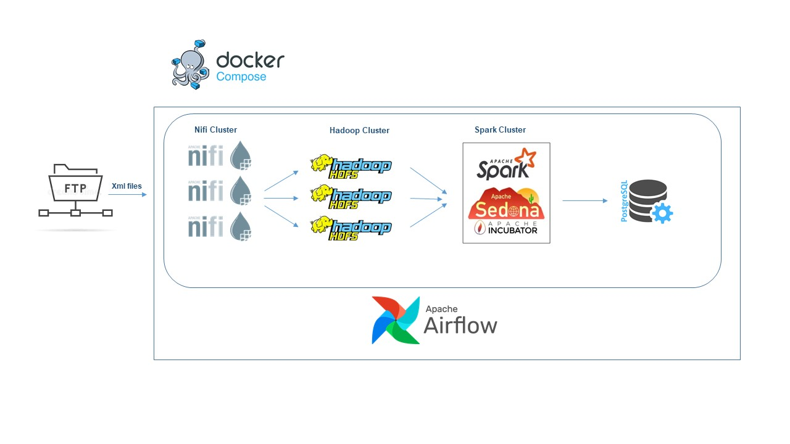
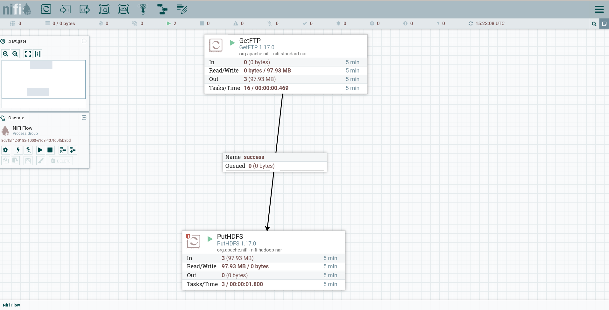
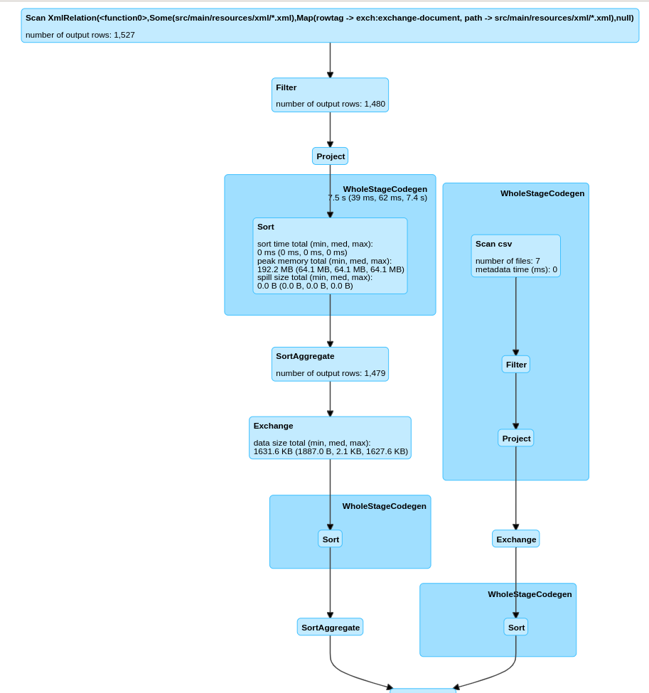
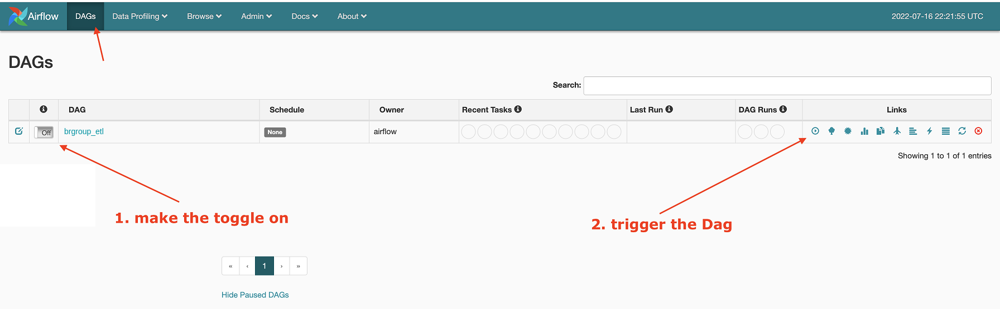

# Spark-Scala Data Pipeline

## Context

A data processing pipeline to parse the input XML files from FTP server and import them into relational database for further analysis and processing.

## Datasets


* `sample_data.xml` - A sample xml file which should be processed
  * Each document is represented as <exch:exchange-document> in xml file


## Requirements

application will need to do the following:
  
* Data processing pipeline to parse the input files and
import them into relational database
* Elements to extract:
  * country
  * doc-number
  * kind
  * doc-id
  * date-publ
  * family-id
  * classification-ipcr (only text)
  * exch:applicant-name (only name)
  * exch:invention-title
  * exch:abstract

* Multiple documents may have same family-id, aggreggate documents on family-id and
preserve values from all entries – only one record per family_id should remain in the
result tables. Take text from the english-language documents only. For example, if one
document has family_id=15, invention-title=My important document,
classification-ipcr=[A01, B01], second document is family_id=15,
invention-title=Mein wichtiger Dokument, classification-
ipcr=[B01, C01], expected outcome is one document with family_id=15,
invention-title=My important document, classification-ipcr=[A01,
B01, C01],

* Each document is uniquely identified by the combination of three attributes country, doc-
number, kind (consider concatenating the three elements before aggregation, so
document with country=DE, kind=A1, doc_number=54829 would receive an
unique identifier ‘DE54829A1’).


# Solution

## Description
This is an End-to-End solution from reading data from ftp server to processing and applying transformation and storing the final result in a postgres database.
To do this, various tools have been used, which are explained below. Also, docker has been used to simulate the operating environment.


## Solution Architecture
To implement this code challenge, the following architecture is used, which the responsibility and the reason for use for each tool are described below.

<p align="center">
  
</p>

### Apache Nifi
I have used Apache Nifi to extract xml data from FTP server and then load them in hadoop hdfs cluster.

Here is the template that I have developed in nifi.

<p align="center">
  
</p>

Because the main purpose of the question is not this section, 
so I have created a minimal template for nifi. 


### Apache Spark
I used Spark to solve the main part of the code challenge. The reason for choosing Spark is that it is very fast and works very well for large-scale problems. Also, there are many provided libraries for different tasks that make the development process faster and better. Another reason is my experience in using Spark.


The solution starts from reading the xml files from hadoop hdfs directory. Next, the requierd transformation is applied to dataframe columns and final dataframe is created. The final dataframe is written to postgres database using jdbc connection.  

<p align="center">
  
</p>


In order to fulfil requierment "The same document might be delivered multiple times, i. e. two weeks in a row", I used checkpoint. In each batch processing, all of document ids (combination of 3 fields including country, doc-number, kind) are logged in hdfs directory and in the begining of next batch, the repeated data will be excluded by checking with logs (using left anti join with original dataframe).
In order to fulfil requierment "only one record per family_id should remain in the result tables, preserve values from all entries", I have implemented multiple things. First of all in current data frame, records are be aggregated based on family_id and valuess from othe fields are collected in array. 
Secondly, in order to have only one record per family_id in the result table, I used upsert mechanism in postgres sql, to update previous inserted records if any conflict occured based on family_id. In such case, records with conflict family_id will be updated and data from other fields will be merged with their updated values. So all entries value will be preserved. 


As another note, I used a config file to make the application more dynamic in different environments. accordingly, this App can be run in different environments such as local, Docker, and production just by changing these values. It is also possible to set some values such as address and port for sources like hdfs as well as spark session configurations without changing the code.


I didn't have enough time to write software tests such as unit tests, integration tests, system tests and etc. to test the correctness of the program. But for programs that are at the enterprise level, this point is very important. 


## Getting Started

This section explains how to run this App. I have tried to make it very simple. 

### Prerequisites
The required prerequisites are:

* Docker and docker-compose 3
* Internet connection to download required docker images and libraries.

### Installation

Follow the steps below to run the App. put the xml files in ftp/xml directory. this directory from localhost is mounted to docker ftp server.

1. running all containers
   ```sh
   $ sudo docker-compose up -d
   ```

2. After a few seconds, open the [airflow](http://localhost:8085/) admin address in your browser (http://localhost:8085/) and then run the ```brgroup_etl``` Dag.
  
<p align="center">
  
</p>

After the dag is finished, the data will be inserted to postgres data base and can be accessed with any postgres sql client.

## Stoping Services
Enter the following command to stop the containers:

```bash
$ sudo docker-compose down -v
```

## Build from source
Enter the following command to build from source. SBT must be installed on the system.

```bash
$ sbt assembly publish
```
The jar file will be created in the ```spark/brgroup/brgroup_2.11/0.1/brgroup_2.11-0.1-assembly.jar``` directory.

## Author

👤 **Hadi Ezatpanah**

- Github: [@hadiezatpanah](https://github.com/hadiezatpanah)

## Version History
* 0.1
    * Initial Release
